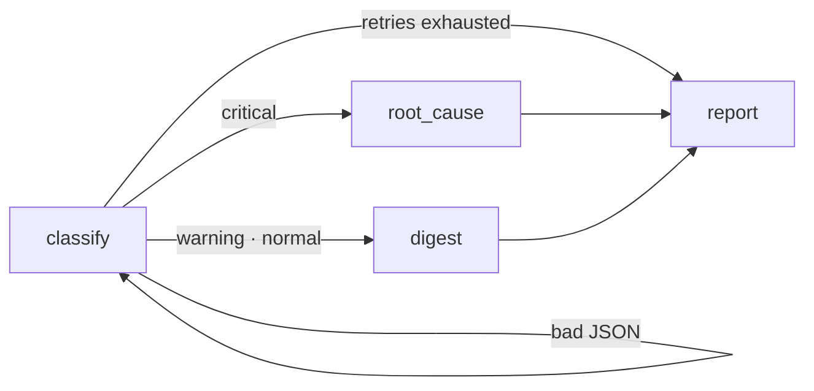

# log-triage-agent

[](https://github.com/egoring/log-triage-agent/actions/workflows/ci.yml)

> 한국어: [README.md](README.md)

**A LangGraph mini agent that triages server logs — conditional branching, retry loop, deterministic reports.**

It classifies log severity, then branches: incidents go to root-cause analysis, quiet days go to a digest. If the LLM returns malformed JSON, the graph retries itself; past the cap, it converges to a failure report.

## Graph



## Design principles

1. **LLM decides, code assembles.** Only classification and analysis touch the LLM; the final report is assembled deterministically in code.
2. **Failure is state, not an exception.** Parse failures set `error`/`retries` in graph state; a conditional edge drives the retry loop, and exhaustion routes to an explicit failure report — the agent never dies silently.
3. **Tests need no network.** Nodes take an injected LLM client, so a scripted mock verifies routing, retries, and report assembly (9 tests).

## Install & use

```bash
pip install -e .

# Backend 1: any OpenAI-compatible API (vLLM, Ollama, ...)
export TRIAGE_API_BASE="https://api.openai.com/v1"
export TRIAGE_API_KEY="sk-..."
export TRIAGE_MODEL="gpt-4o-mini"
log-triage data/incident.log

# Backend 2: Claude subscription via Claude Code CLI (no API key)
log-triage data/incident.log --backend claude-cli
```

Two synthetic logs are bundled: `data/incident.log` (repeated OOM → critical path) and `data/normal.log` (quiet day → digest path).

## Observability (Langfuse, optional)

```bash
pip install -e ".[obs]"
export LANGFUSE_PUBLIC_KEY="pk-..."
export LANGFUSE_SECRET_KEY="sk-..."
export LANGFUSE_HOST="https://cloud.langfuse.com"
```

With keys set, every run leaves one trace — per-node spans (classify · root_cause · digest · report) with timings, retry count, and final severity. Without keys the tracing layer is a complete no-op.

## Tests

```bash
pip install -e ".[dev]"
pytest   # 13 tests, no network
```

## See also

- [judge-mcp](https://github.com/egoring/judge-mcp) — LLM-as-Judge evaluation MCP server
- [sql-guard-mcp](https://github.com/egoring/sql-guard-mcp) — read-only SQL guard for AI agents

## License

MIT
