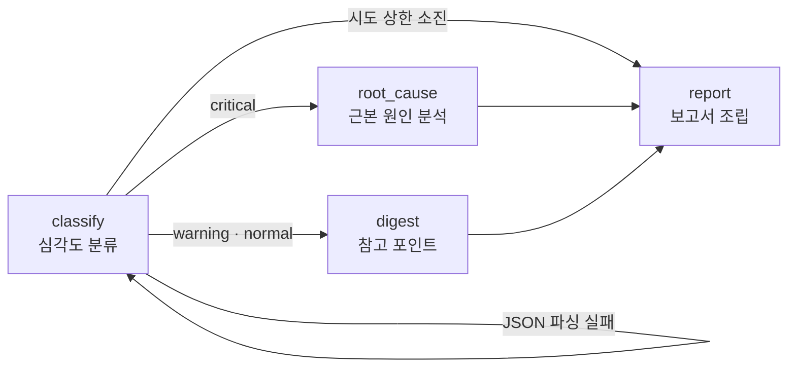

# log-triage-agent

[](https://github.com/egoring/log-triage-agent/actions/workflows/ci.yml)

> English: [README.en.md](README.en.md)

**서버 로그를 트리아지하는 LangGraph 미니 에이전트 — 조건 분기·재시도 루프·결정적 보고서.**

로그를 읽고 심각도를 분류한 뒤, 장애면 근본 원인 분석으로, 평시면 다이제스트로 경로가 갈립니다. LLM 응답이 깨지면 그래프가 스스로 재시도하고, 상한을 넘으면 실패 보고서로 수렴합니다.

## 이런 상황에서 씁니다

**상황** — 새벽 배치가 죽으면 아침에 출근한 담당자가 로그 수천 줄을 위에서부터 훑는다. 아무 일 없는 날에도 "아무 일 없음"을 확인하는 데 시간이 든다.

**도입 후** — 스케줄러가 아침마다 밤새 로그를 트리아지한다. 장애면 근본 원인·근거 로그·권장 조치가 담긴 보고서, 평시면 참고 포인트 몇 줄. 온콜 담당자는 원인 후보부터 보며 하루를 시작한다.

## 그래프 구조



## 설계 원칙

1. **판단은 LLM, 조립은 코드.** 분류·분석만 LLM이 하고, 최종 보고서는 코드가 결정적으로 조립합니다. 같은 분석 결과면 항상 같은 보고서가 나옵니다.
2. **실패를 그래프 안에서 처리.** JSON 파싱 실패는 예외가 아니라 상태(`error`, `retries`)입니다. 조건 엣지가 재시도 루프를 돌리고, 상한(2회)을 넘으면 실패 보고서로 직행합니다 — 에이전트가 조용히 죽지 않습니다.
3. **테스트는 네트워크 없이.** 노드는 LLM 클라이언트를 주입받으므로, 모의 클라이언트로 라우팅·재시도·보고서 조립을 전부 검증합니다 (9건).

## 설치·사용

```bash
pip install -e .

# 백엔드 1: OpenAI 호환 API (vLLM·Ollama 포함)
export TRIAGE_API_BASE="https://api.openai.com/v1"
export TRIAGE_API_KEY="sk-..."
export TRIAGE_MODEL="gpt-4o-mini"
log-triage data/incident.log

# 백엔드 2: Claude 구독 (API 키 불필요, Claude Code 설치·로그인 필요)
log-triage data/incident.log --backend claude-cli
```

합성 로그 2종이 동봉돼 있습니다 — `data/incident.log`(OOM 반복 → critical 경로), `data/normal.log`(평시 → digest 경로).

### 출력 예시 (critical 경로)

```markdown
# 로그 트리아지 보고서 — CRITICAL

- **분류**: oom
- **요약**: 워커가 메모리 부족으로 반복 종료

## 근본 원인
...

## 권장 조치
1. ...
```

## 관측 (Langfuse, 선택)

```bash
pip install -e ".[obs]"
export LANGFUSE_PUBLIC_KEY="pk-..."
export LANGFUSE_SECRET_KEY="sk-..."
export LANGFUSE_HOST="https://cloud.langfuse.com"   # 셀프호스팅이면 해당 주소
```

키만 설정하면 실행마다 트레이스 1건이 남습니다 — 노드별(classify·root_cause·digest·report) 스팬과 실행 시간, 재시도 횟수, 최종 심각도까지. 키가 없으면 관측 코드는 완전 무동작(no-op)이라 성능·동작에 영향이 없습니다.

## 테스트

```bash
pip install -e ".[dev]"
pytest   # 13건, 네트워크 불필요 — critical/normal 라우팅, 재시도 루프, 상한 소진, 파싱 내성, 트레이서 기록
```

## 함께 보기

- [judge-mcp](https://github.com/egoring/judge-mcp) — LLM-as-Judge 평가 MCP 서버
- [sql-guard-mcp](https://github.com/egoring/sql-guard-mcp) — AI 에이전트용 읽기 전용 SQL 가드

## 라이선스

MIT
